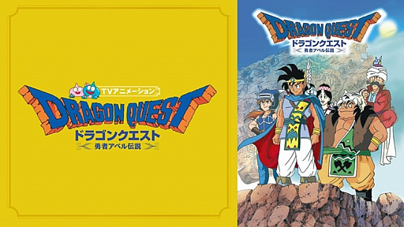
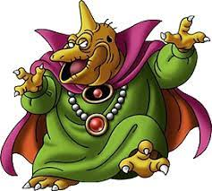
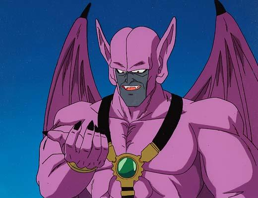

**DQ関連のアニメ**

# ドラゴンクエスト
## <勇者アベル伝説>  

**1989年に放送されていたドラゴンクエストIIIを題材とした  
アニメーション作品**  

ドラゴンクエストシリーズの世界・舞台設定が再現されており、テレビゲーム版ドラゴンクエストの第1作目から第4作目までに登場したモンスターやアイテム、呪文などが本作品中に登場した。また、エスタークやアリアハンなどといった、ゲームに登場した地名やキャラクター名がこのアニメ作品で地名として登場したり、人物名として登場したこともあった。BGMもゲームのものがアレンジのうえ一部使用されていた。  

追記)  

**実際のゲーム内でのバラモス**  
  

**アベル伝説内でのバラモス**  
  

ちっ、違いすぎないか？w